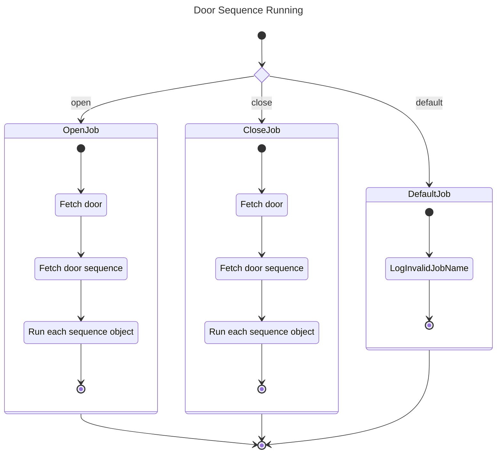
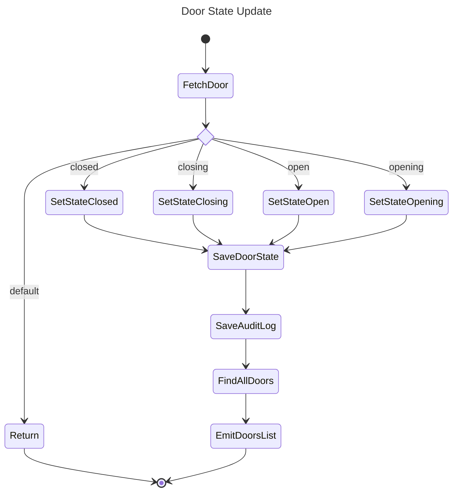

# Events

This document outlines the events and how they related to the API and other
internal service handlers. By using events this allows certain actions to be
asynchronous and non-blocking.

## Queue/Processor Mapping Table

For convenience of all the queues/processors see this table below.

| Bull Queue         | Processor              |
| ------------------ | ---------------------- |
| doors-sequence-run | DoorsSequenceProcessor |
| doors-state-update | DoorsStateProcessor    |

## Door Sequence Processor

This is ran from the `doors-sequence-run` queue. It handles the asynchronous
running of door sequences. I.e. when the API or websocket initiates running
a sequence it simply pushes a message to the queue for processing.

## Door State Processor

This is ran from the `doors-state-update` queue and is responsible for updating
a doors state in the database/emitting via websockets.

Note: Sometimes there may have been a delay in this message arriving on this
queue (such as the door "opened" or "closed") as this occurs many seconds
after the sequence has completed.

