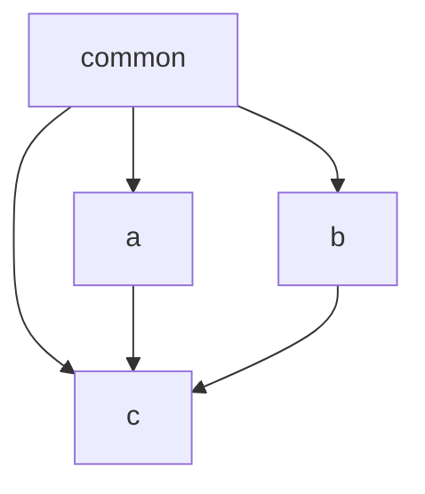
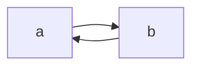

# Modules

This file outlines the modules that have been defined and the order of imports.

## Avoid Circular Imports

This is important as proper forethought will prevent circular imports from
occuring. To make it easier it can be thought of as "layers" in a cake.
You can only go from the first (most common) layer down or diagonally down.

For example say you had a common module `common` with two feature modules
`a` and `b` that imported `common`. In addition there is also another
feature model `c` that imports the `common`, `a` and `b` modules. This would
look like below.

As you can see from the above diagram there would be no cyclic imports as no
two modules are dependenant on one another.

We want to avoid the above scenario where two modules need to import from one
another as this will cause a cyclic import issue. Whilst NestJS has ways to
handle this situation it is better to architect the modules in a way to avoid
this issue in the first place.

## Why Think About This?

The first architecture of this project simply took each module as a
feature/bounded context. This meant that all things "door related" would be
located in the door module.

Although this makes it clean from one perspective
(i.e. all database, gateway, processors, etc) are located in the one place,
it makes it very to share things around.

The other issue is that it makes it hard to understand how the parts of the
application fit together. By structuring things into modules by what they do
instead of what they are it means it is easier to understang/group related
code (like bull queue processors).

It's worth noting that the NestJS ClI has some naming conventions to be aware of.
When you create a resource it creates a module by the name entered as well as
a controller, service as well as entity and DTO classes. Sometimes we may
need to override this behaviour and manually create modules/files etc.

## Structure

This results in us having the following layout as feature modules.

- Audit Logs
- Auth
- Automation Hat
- Client Version
- Doors
- Entities
- Health
- Logger
- Middleware
- Migrations
- Seeders
- Test (Test API not Unit Tests)
